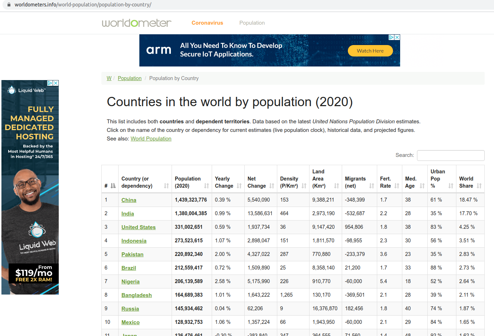
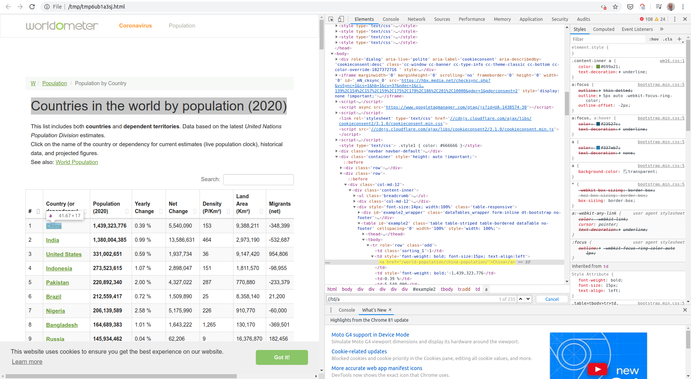

# scrapy-demo
Scrapy framework demo project

# Why Scrapy?

Libraries like Requests and BeautifulSoup can extract data from HTML web pages but are not suitable for complex projects. They can be used for simple tasks like scraping a single HTML page but are not suitable for e.g. scraping hundreds of web pages simultanuosly.

On my machine, Scrapy benchmark showed it can scrape 2940 pages per minute (this depends on CPU, available RAM etc...):

```
$ scrapy bench
...
2020-04-25 23:57:12 [scrapy.extensions.logstats] INFO: Crawled 646 pages (at 2940 pages/min), scraped 0 items (at 0 items/min)
...
```

# Scrapy Architecture

* Spiders
* Pipelines
* Middleware
* Engine
* Scheduler


## Spiders

This is where we define what we want to extract from a web page.

It is responsible for scraping the content from a web page (web response).

There are different types/classes of spiders:
* scrapy.Spider
* CrawlSpider
* XMLFeedSpider - for scraping XML files
* CSVFeedSpider - for scraping comma-separated values files
* SitemapSpider - for scraping sitemaps

Within a project we usually create one or more spiders.

## Pipelines

Used for processing extracted data. E.g.:
* Cleaning the data
* Removing duplication
* Storing data in external database

## Middleware

Deals with web requests and responses. E.g.:
* Injecting custom headers
* Proxying

There are two types of middleware:
* Downloader Middleware - responsible for sending request and getting response from the target website
* Spider Middleware - responsible for extracting data from response

## Engine

Coordinates all other components

## Scheduler

Preserves the order of operations. Implemented as queue (FIFO).

## How do they work together?

Spider sends request to Engine.

Engine transmits it to Scheduler. If there was some request sent earlier, this one would be served first. Scheduler sends request to be served back to Engine.

Engine sends request to Middleware (Downloader Middleware, responsible for getting response from the target website). Middleware sends response to the Engine.

Engine then sends response to Spider (Spider Middleware which is responsible for extracting data). Extracted data is then sent to Engine.

Engine forwards data to Pipeline which processes it.

# robots.txt

Most of websites contain a file `robots.txt` in root directory.

It gives instructions to spiders whether they can crawl/scrape the website and if yes, then which content (pages).

It contains a set of grouped instructions. Each group contains 3 properties:
* `User-Agent`: name of the agent; represents the identity of the spider
* `Allow`: specifies path (web page) that can be crawled/scraped
* `Disallow`: specifies path (web page) that must NOT be crawled/scraped

Example of `robtots.txt` for website which allows scraping any page:
```
User-Agent: *
Disallow:
Allow: /
```

# How to install Scrapy

Scrapy should be installed in virtual environment in order not to mess up globally installed packages:

```
$ virtualenv --python=python3.6 venv
$ source venv/bin/activate
(venv) $ pip install scrapy
```

# Scrapy CLI (in a non-project directory)

This is the Scrapy CLI when `scrapy` is executed in a directory which is not a Scrapy project directory (it does not contain `scrapy.cfg`):

```
$ scrapy
Scrapy 2.1.0 - no active project

Usage:
  scrapy <command> [options] [args]

Available commands:
  bench         Run quick benchmark test
  fetch         Fetch a URL using the Scrapy downloader
  genspider     Generate new spider using pre-defined templates
  runspider     Run a self-contained spider (without creating a project)
  settings      Get settings values
  shell         Interactive scraping console
  startproject  Create new project
  version       Print Scrapy version
  view          Open URL in browser, as seen by Scrapy

  [ more ]      More commands available when run from project directory

Use "scrapy <command> -h" to see more info about a command
```

To run a benchmark:
```
$ scrapy bench
```

To fetch HTML of a web page:
```
$ scrapy fetch https://www.google.com
```

shell is used to perform some experiments on web sites we want to scrape, before writing a spider.


# How to create a project?

In this repo, project (and directory) `worldometers` was created with:

```
(venv) $ scrapy startproject worldometers
New Scrapy project 'worldometers', using template directory '/home/xxx/dev/github/scrapy-demo/venv/lib/python3.6/site-packages/scrapy/templates/project', created in:
    /home/xxx/dev/github/scrapy-demo/worldometers

You can start your first spider with:
    cd worldometers
    scrapy genspider example example.com
```

This creates: `scrapy.cfg` file and `worldometers` directory within `worldometers` directory.

`scrapy.cfg` is important for executing spiders we create and for deploying our spiders to Scrapy deamon, Heroku etc...

`worldometers/worldometers/spiders` is initially an empty Python module (contains only `__init__.py`). This is where out spiders will be implemented.

`worldometers/worldometers/items.py` is used to clean the data we scrape and to store the data inside fields we created. In our case it contains (initially an empty) class `WorldometersItem` which inherits `scrapy.Item`.

`worldometers/worldometers/middlewares.py` contains middlewares which are responsible for requests and responses:
* class `WorldometersDownloaderMiddleware` - Downloader Middleware.
* class `WorldometersSpiderMiddleware` - Spider Middleware.

`worldometers/worldometers/pipelines.py` contains class `WorldometersPipeline` for storing scraped items into data base.

`worldometers/worldometers/settings.py` contains various settings.

# How to create a spider within a project?

It is possible to have multiple spiders within a project. Each spider is uniquely identified by its name.

Example: we want to scrape data from https://www.worldometers.info/world-population/population-by-country/.



```
$ scrapy genspider countries www.worldometers.info/world-population/population-by-country
Created spider 'countries' using template 'basic' in module:
  worldometers.spiders.countries
```

This creates file `worldometers/worldometers/spiders/countries.py` which contains class `CountriesSpider` which inherits `scrapy.Spider`. It has the following predefined properties:
* `name` - set to name uniquely identifies this spider: `countries`
* `allowed_domains` - list of domain names that spider is allowed to access and scrape. Originally it contains `www.worldometers.info/world-population/population-by-country` but we can remove path in this url and leave only domain name: `www.worldometers.info/`. If any scraped page contains links to web pages at any other domain name, those pages will not be scraped. Domain name does not contain protocol prefix (e.g. `http://`).
* `start_urls` - contains all the links we want to scrape. Originally, it contains `http://www.worldometers.info/world-population/population-by-country/` (Scrapy uses `http://` protocol by default) but we can change it to `https://www.worldometers.info/world-population/population-by-country/` (if website supports https).

This class also contains an empty `parse` method which receives a response as its parameter. We'll later modify this method in order to extract data from response.

To inspect `scrapy.Spider` class you can do:
```
$ python
Python 3.6.9 (default, Apr 18 2020, 01:56:04)
[GCC 8.4.0] on linux
Type "help", "copyright", "credits" or "license" for more information.
>>> import scrapy
>>> help(scrapy.Spider)
>>> exit()
```
or simply extract documentation for entire package into a html file you can then refer to:
```
(venv) ../scrapy-demo/worldometers$ pydoc -w scrapy
wrote scrapy.html
```

`scrapy list` (when run from a project directory) lists all spiders so after a new spider is created, we can see it listed:
```
(venv) ../scrapy-demo/worldometers$ scrapy list
countries
```

# Scrapy shell

It is used before we build spiders, to experiment with website and do some basic element selection, do debug XPath expressions or CSS selectors.
`ipython` package has to be installed.

```
$ scrapy shell
2020-04-28 07:56:52 [scrapy.utils.log] INFO: Scrapy 2.1.0 started (bot: worldometers)
2020-04-28 07:56:52 [scrapy.utils.log] INFO: Versions: lxml 4.5.0.0, libxml2 2.9.10, cssselect 1.1.0, parsel 1.5.2, w3lib 1.21.0, Twisted 20.3.0, Python 3.6.9 (default, Apr 18 2020, 01:56:04) - [GCC 8.4.0], pyOpenSSL 19.1.0 (OpenSSL 1.1.1g  21 Apr 2020), cryptography 2.9.2, Platform Linux-4.15.0-96-generic-x86_64-with-Ubuntu-18.04-bionic
2020-04-28 07:56:52 [scrapy.utils.log] DEBUG: Using reactor: twisted.internet.epollreactor.EPollReactor
2020-04-28 07:56:52 [scrapy.crawler] INFO: Overridden settings:
{'BOT_NAME': 'worldometers',
 'DUPEFILTER_CLASS': 'scrapy.dupefilters.BaseDupeFilter',
 'LOGSTATS_INTERVAL': 0,
 'NEWSPIDER_MODULE': 'worldometers.spiders',
 'ROBOTSTXT_OBEY': True,
 'SPIDER_MODULES': ['worldometers.spiders']}
2020-04-28 07:56:52 [scrapy.extensions.telnet] INFO: Telnet Password: a9bcdf89cb40008b
2020-04-28 07:56:52 [scrapy.middleware] INFO: Enabled extensions:
['scrapy.extensions.corestats.CoreStats',
 'scrapy.extensions.telnet.TelnetConsole',
 'scrapy.extensions.memusage.MemoryUsage']
2020-04-28 07:56:52 [scrapy.middleware] INFO: Enabled downloader middlewares:
['scrapy.downloadermiddlewares.robotstxt.RobotsTxtMiddleware',
 'scrapy.downloadermiddlewares.httpauth.HttpAuthMiddleware',
 'scrapy.downloadermiddlewares.downloadtimeout.DownloadTimeoutMiddleware',
 'scrapy.downloadermiddlewares.defaultheaders.DefaultHeadersMiddleware',
 'scrapy.downloadermiddlewares.useragent.UserAgentMiddleware',
 'scrapy.downloadermiddlewares.retry.RetryMiddleware',
 'scrapy.downloadermiddlewares.redirect.MetaRefreshMiddleware',
 'scrapy.downloadermiddlewares.httpcompression.HttpCompressionMiddleware',
 'scrapy.downloadermiddlewares.redirect.RedirectMiddleware',
 'scrapy.downloadermiddlewares.cookies.CookiesMiddleware',
 'scrapy.downloadermiddlewares.httpproxy.HttpProxyMiddleware',
 'scrapy.downloadermiddlewares.stats.DownloaderStats']
2020-04-28 07:56:52 [scrapy.middleware] INFO: Enabled spider middlewares:
['scrapy.spidermiddlewares.httperror.HttpErrorMiddleware',
 'scrapy.spidermiddlewares.offsite.OffsiteMiddleware',
 'scrapy.spidermiddlewares.referer.RefererMiddleware',
 'scrapy.spidermiddlewares.urllength.UrlLengthMiddleware',
 'scrapy.spidermiddlewares.depth.DepthMiddleware']
2020-04-28 07:56:52 [scrapy.middleware] INFO: Enabled item pipelines:
[]
2020-04-28 07:56:52 [scrapy.extensions.telnet] INFO: Telnet console listening on 127.0.0.1:6023
[s] Available Scrapy objects:
[s]   scrapy     scrapy module (contains scrapy.Request, scrapy.Selector, etc)
[s]   crawler    <scrapy.crawler.Crawler object at 0x7f1244bf6278>
[s]   item       {}
[s]   settings   <scrapy.settings.Settings object at 0x7f1244c72dd8>
[s] Useful shortcuts:
[s]   fetch(url[, redirect=True]) Fetch URL and update local objects (by default, redirects are followed)
[s]   fetch(req)                  Fetch a scrapy.Request and update local objects
[s]   shelp()           Shell help (print this help)
[s]   view(response)    View response in a browser
>>>
```

Let's try to fetch a web page:

```
>>> fetch("https://www.worldometers.info/world-population/population-by-country/")
2020-04-28 08:01:15 [scrapy.core.engine] INFO: Spider opened
2020-04-28 08:01:16 [scrapy.core.engine] DEBUG: Crawled (404) <GET https://www.worldometers.info/robots.txt> (referer: None)
2020-04-28 08:01:16 [protego] DEBUG: Rule at line 2 without any user agent to enforce it on.
2020-04-28 08:01:16 [protego] DEBUG: Rule at line 10 without any user agent to enforce it on.
2020-04-28 08:01:16 [protego] DEBUG: Rule at line 12 without any user agent to enforce it on.
2020-04-28 08:01:16 [protego] DEBUG: Rule at line 14 without any user agent to enforce it on.
2020-04-28 08:01:16 [protego] DEBUG: Rule at line 16 without any user agent to enforce it on.
2020-04-28 08:01:16 [scrapy.core.engine] DEBUG: Crawled (200) <GET https://www.worldometers.info/world-population/population-by-country/> (referer: None)
```

HTTP error 404 (Not Found) for robots.txt means that this website doesn't provide this file so there are no restrictions on pages we can scrape.

We can also create request and pass it to `fetch()`:
```
>>> r = scrapy.Request(url="https://www.worldometers.info/world-population/population-by-country/")
>>> fetch(r)
2020-04-28 08:06:14 [scrapy.core.engine] DEBUG: Crawled (200) <GET https://www.worldometers.info/world-population/population-by-country/> (referer: None)
```

It is not possible to assign response to a variable and keep multiple responses. The response of the last request is kept in variable named `response`.

To see the HTML from response:
```
>>> response.body
b'\n<!DOCTYPE html><!--[if IE 8]> <html lang="en" class="ie8">...
...
```

To see how spiders see web page:
```
>>> view(response)
True
>>> Opening in existing browser session.
```

This saves a web page in temp file and opens that file in a default browser.

Spiders see web pages without JavaScript. To see how they see them, we can disable JS on this temp html file in the browser:
* open Developer Tools (CTRL+SHIFT+I)
* open Control Panel (CTRL+SHIFT+P)
* disable JavaScript

Spiders can't render JavaScript.

## How to scrape elements from a web page in shell?

### Example #1

From https://www.worldometers.info/world-population/population-by-country/ we want to scrape a title, which is "Countries in the world by population (2020)".

In a browser, we load this page, select the desired element, right click and Inspect. Developer Tools opens and we can see the position of that element in HTML. CTRL+F opens search bar where we can type our XPath expression. As the title is the text within `h1` tag we write:
```
//h1
```
This will highlight the title.

We can use this XPath expression to query the HTML response we got in Scrapy shell earlier. The output is a list with a single Selector element:
```
>>> response.xpath("//h1")
[<Selector xpath='//h1' data='<h1>Countries in the world by populat...'>]
```

To get just text we need to call XPath function `text()`:
```
>>> response.xpath("//h1/text()")
[<Selector xpath='//h1/text()' data='Countries in the world by population ...'>]
```
We can assign the result to a variable of type `Selector`:
```
>>> title = response.xpath("//h1/text()")
```
...and to return just `data` member we can use `get()`:
```
>>> title.get()
'Countries in the world by population (2020)'
```

If we find
```
...
class CountriesSpider(scrapy.Spider):
...
```
...place mouse pointer on `Spider` in `scrapy.Spider` and press F12 we'll get `venv/lib/python3.6/site-packages/scrapy/spiders/__init__.py` opened. If we find there
```
from scrapy.http import Request
```
...and press F12 on `http` in `scrapy.http` we'll get
```
venv/lib/python3.6/site-packages/scrapy/http/__init__.py
```
If we then press F12 on `TextResponse` in `from scrapy.http.response.text import TextResponse` we'll get:
```
venv/lib/python3.6/site-packages/scrapy/http/response/text.py
```
Here we can see:
```
def xpath(self, query, **kwargs):
    return self.selector.xpath(query, **kwargs)
```
So let's press F12 on `Selector` in `from scrapy.selector import Selector`. We'll get:
```
venv/lib/python3.6/site-packages/scrapy/selector/unified.py
```
There we find `from parsel import Selector as _ParselSelector`
Let's press F12 on `Selector`. We'll get:

```
venv/lib/python3.6/site-packages/parsel/selector.py
```
...where we can finally find definition of `xpath()` method:

```
def xpath(self, query, namespaces=None, **kwargs):
    """
    Find nodes matching the xpath ``query`` and return the result as a
    :class:`SelectorList` instance with all elements flattened. List
    elements implement :class:`Selector` interface too.

    ``query`` is a string containing the XPATH query to apply.

    ``namespaces`` is an optional ``prefix: namespace-uri`` mapping (dict)
    for additional prefixes to those registered with ``register_namespace(prefix, uri)``.
    Contrary to ``register_namespace()``, these prefixes are not
    saved for future calls.

    Any additional named arguments can be used to pass values for XPath
    variables in the XPath expression, e.g.::

        selector.xpath('//a[href=$url]', url="http://www.example.com")
    """

def get(self):
    """
    Serialize and return the matched nodes in a single unicode string.
    Percent encoded content is unquoted.
    """

def getall(self):
    """
    Serialize and return the matched node in a 1-element list of unicode strings.
    """
```

To use CSS Selector:
```
>>> title_css = response.css("h1::text")
>>> title_css.get()
'Countries in the world by population (2020)'
```

CSS selector uses XPath selector underneath:
```
>>> title_css
[<Selector xpath='descendant-or-self::h1/text()' data='Countries in the world by population ...'>]
```
...which means that we can avoid this extra step by using XPath selector directly.

### Example #2

We want to get the names of all countries from the web page.

XPath expresson
```
//td/a
```
returns 235 results:



As the result of XPath query is a list of multiple Selectors, we need to use `getall()`:
```
>>> countries = response.xpath("//td/a/text()").getall()
>>> countries
['China', 'India', 'United States',...]
```

Version with CSS selector:
```
>>> countries = response.css(" td a::text").getall()
>>> countries
['China', 'India', 'United States',
```

Use exit() or Ctrl-D (i.e. EOF) to exit:
```
exit()
```
# How to implement a spider?

We need to go to `worldometers/worldometers/spiders/countries.py` and in `CountriesSpider` add some code to the body of the `parse` function. We can use someting like:

```
single_item = response.xpath("//../ ... /../text()").get()
items_list = response.xpath("//../ ... /../ /text()").getall()

yield {
    'single_item': single_item
    'items_list': items_list
}
```

# Scrapy CLI (from a project directory)

If `scrapy` is run from a project directory (the one which contains `scrapy.cfg`), new commands are available:

```
(venv) ../scrapy-demo/worldometers$ scrapy
Scrapy 2.1.0 - project: worldometers

Usage:
  scrapy <command> [options] [args]

Available commands:
  bench         Run quick benchmark test
  check         Check spider contracts
  crawl         Run a spider
  edit          Edit spider
  fetch         Fetch a URL using the Scrapy downloader
  genspider     Generate new spider using pre-defined templates
  list          List available spiders
  parse         Parse URL (using its spider) and print the results
  runspider     Run a self-contained spider (without creating a project)
  settings      Get settings values
  shell         Interactive scraping console
  startproject  Create new project
  version       Print Scrapy version
  view          Open URL in browser, as seen by Scrapy

Use "scrapy <command> -h" to see more info about a command
```

# How to list all spiders?

From a project root directory (the one which contains `scrapy.cfg`) run `scrapy list`:
```
(venv) ../scrapy-demo/worldometers$ scrapy list
countries
```

# How to run a spider?

From a project root directory run `scrapy crawl <spider_name>`:

```
(venv) ../scrapy-demo/worldometers$ scrapy crawl countries
```


# CSS

CSS = Cascading Style Sheet; language created to style HTML pages.

CSS selectors use CSS to find HTML elements.

Sometimes CSS selectors have cleaner syntax than XPath. Example:
Compare selectors for this element:
```
<div class='classA classB'>...</div>
```

XPath: `//div[@class='classA classB']`

CSS: `.classA.classB`

Copy-paste HTML document from https://pastebin.com/ZS0ALH8t to https://try.jsoup.org/ and use "CSS Query" field to
filter the HTML by CSS. It is also possible to type in the URL and use "Fetch URL" to load any web page.

## Examples how to select elements based on their tags (names) and attributes:

`h1` returns all "h1" elements.

`h1, h2` returns all "h1" and "h2" elements.

`li` returns all "li" elements.

`.bold` returns all elements which contain class "bold".

`#location` returns all elements which have `id="location"`
`#location#position` returns all elements which have `id="location"` and elements which have `id="position"`

Multiple tags can have `class` attribute set to the same value.
Only one tag can have `id` attribute set to some value.

`div.intro` selects only those `div` elements that have `class` attribute set to "intro".

`span#location` selects only that `span` elements which has `id` attribute set to "location".

(Since `id` is unique, we can use just `id` value in selector: `#location`).

`bold.italic` selects elements which has `class` attribute set to "bold" and "italic".

CSS has other standard attrubutes like `href` and also non-standard ("foreign") attributes which are not included in HTML standard like e.g. `data-identifier`.

`li[data-identifier=7]` selects `li` tag which has `data-identifier` attribute set to 7.

`[data-identifier=7]` selects any tag which has `data-identifier` attribute set to 7.

It is possible to specify conditions for filtering values.

`a[href^=https]` selects all `a` elements whose `href` attribute start with "https".

`a[href^=http]:not(a[href^=https])` selects all `a` elements whose `href` attribute start with "http" but not with "https".

`a[href$=rs]` selects all `a` elements whose `href` attribute ends with "rs".

`a[href*=google]` selects all `a` elements whose `href` attribute contains "google".


## Examples how to select elements based on their positions:

`div p` selects all `p` elements that are within any `div`.

`div.intro p` selects all `p` elements that are within `div` which `class` is set to "intro".

This will not include descendants of that `div` though. If we want to include them as well:

`div.intro p, span#location` or `div.intro p, #location`

`div.intro > p` selects all `p` elements that are direct children of `div` which `class` is set to "intro".

`div.intro + p` selects all `p` elements that are placed immediately after `div` which `class` is set to "intro".

Desired element MUST be immediately after `div`.

E.g. `div.intro + span` in our example won't return anything as `span` is not placed immediately after `div`.

`>` and `+` signs in CSS terminology are known as *CSS combinators*.

General sibling combinator `~` is used to select elements that are placed after some other element regradless whether thety are placed immediately or not after it. E.g.

`div ~ p` selects p element in this case:

```
div

some other elements

p
```

`li:nth-child(1)` selects 1st `li` element within its parent (`ul` in our example).

`li:nth-child(1), li:nth-child(3)` selects 1st and 3rd `li` element within its parent (`ul` in our example).

`li:nth-child(odd)` selects all `li` element at odd index positions within their parent (`ul` in our example).

`li:nth-child(even)` selects all `li` element at even index positions within their parent (`ul` in our example).


# XPath

XPath = XML Path Language; can be used for HTML.

We use XPath selectors against elements tree to select nodes.

CSS selectors look cleaner but XPath selectors are richer in functionality.

XPath allows going up and down the HTML while CSS does not.

To practice XPath selectors copy-paste your HTML file into https://scrapinghub.github.io/xpath-playground/ and enter XPath expression in the 'XPath' field.

Selector starts with double slash.

## Selecting elements by name, attributes and values

`//h1` returns all `h1` elements.

To select element by the value of its attribute use `[@attribute=value]` predicate (condition expression):

`//div[@class='intro']` returns all `div` elements which have `class` attribute set to 'intro'.

<br/>
<br/>
If query returns multiple results (an array), we can select desired result by using index syntax:
E.g.

`//table[@class="table table-striped table-bordered table-hover table-condensed table-list"]`

returns 2 tables but we want only the first one. We'll use:

`(//table[@class="table table-striped table-bordered table-hover table-condensed table-list"])[1]`
<br/>
<br/>

`//div[@class='intro']/p` returns all `p` elements inside all `div` elements which have `class` attribute set to 'intro'.

`//div[@class='intro' or @class='intro']` returns all `div` elements which have `class` attribute set to 'intro' or 'outro'.

`//div[@class='intro']/p/text()` returns text values of all `p` elements inside all `div` elements which have `class` attribute set to 'intro'.

`//a/@href` returns `href` attribute value for each `a` element.

`//a[starts-with(@href, 'https')]` returns all `a` elements with `href` attribute whose value starts with 'https'.

`//a[ends-with(@href, 'fr')]` returns all `a` elements with `href` attribute whose value ends with 'fr'.

`//a[contains(@href, 'google')]` returns all `a` elements with `href` attribute whose value contains 'google'.

Functions used above are available in XPath 2.0 but Chrome uses libxml2 which implements XPath 1.0.

[https://stackoverflow.com/questions/26163241/what-version-of-xpath-is-implemented-in-xmllibxml/]

[https://stackoverflow.com/questions/25455351/does-chrome-use-xpath-2-0]

`//a[contains(text(), 'France')]` returns all `a` elements whose text value contains 'France'. String passed to `contains()` function is case sensitive.

## Selecting elements by their position

`//ul[@id='items']/li` returns all `li` elements from within `ul` element with `id` with value 'items'.

`//ul[@id='items']/li[1]` returns 1st `li` elements from within `ul` element with `id` with value 'items'. Index starts from 1.

`//ul[@id='items']/li[position() = 1 or position() = 4]` returns 1st AND 4th `li` element from within `ul` element with `id` with value 'items'. position() values start from 1.

`//ul[@id='items']/li[position() = 1 and contains(@text, 'hello')]` returns 1st `li` element from within `ul` element with `id` with value 'items'. position() values start from 1 but only if its text contains word 'hello'.

`//ul[@id='items']/li[position() = 1 or position() = last()]` returns 1st and last `li` element from within `ul` element with `id` with value 'items'. `last()` helps so we don't need to count the index of the last item.

`//ul[@id='items']/li[position() > 1]` returns all `li` element apart from the first one from within `ul` element with `id` with value 'items'. position() values start from 1.

## Going up the HTML tree

`//p[@id='unique']/parent::div` returns a `div` parent of `p` which has `id` with value 'unique'.

Parent in XPath is called an axis. Axises (like `parent`, `ancestor` etc...) are used to navigate in HTML tree markup.

If we don't know the parent element tag we can use `node()` which figures out what is the parent element automatically:

`//p[@id='unique']/parent::node()` returns the parent element (whichever it is) of `p` which has `id` with value 'unique'.

`//p[@id='unique']/ancestor::node()` returns all ancestor elements (parent and grandparent) of this `p`.

`//p[@id='unique']/ancestor-or-self::node()` returns all ancestor elements of this `p` and `p` itself.

`//p[@id='unique']/preceding::node()` returns all elements that precede this `p` excluding ancestors.

`//p[@id='unique']/preceding::h1` returns all `h1` elements that precede this `p`.

Elements are considered siblings if they share the same parent.

`//p[@id='outside']/preceding-sibling::node()` returns sibling element of `p`.

## Going down the HTML tree

`//div[@class='intro']/p` returns all `p` elements inside all `div` elements which have `class` attribute set to 'intro'.

This is the shortcut of using `child` axis:

`//div[@class='intro']/child::p` returns all `p` elements inside all `div` elements which have `class` attribute set to 'intro'.

`//div[@class='intro']/child::node()` returns all child elements (regardless od their tag type) inside all `div` elements which have `class` attribute set to 'intro'.

`//div[@class='intro']/following::node()` returns all elements after this `div`.

`//div[@class='intro']/following-sibling::node()` returns all elements after this `div` which are its siblings.

`//div[@class='intro']/descendant::node()` returns all elements within this `div` which are its children and grandchildren.

# References:

https://docs.scrapy.org/en/latest/topics/commands.html
https://jsoup.org/apidocs/org/jsoup/select/Selector.html

